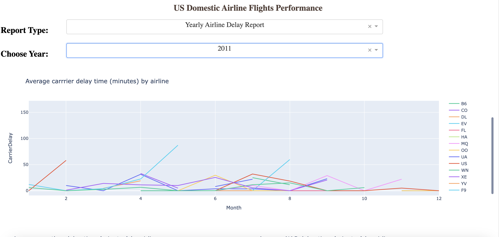
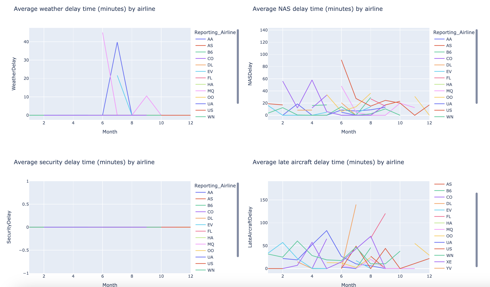
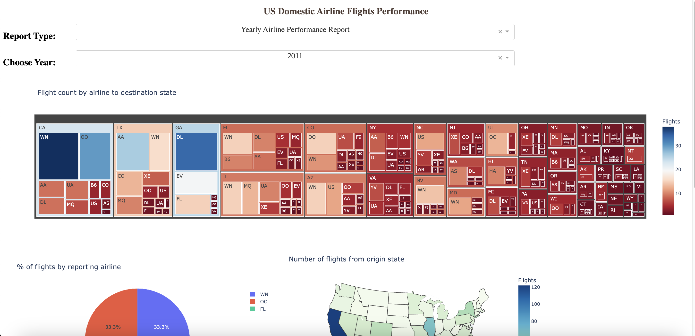
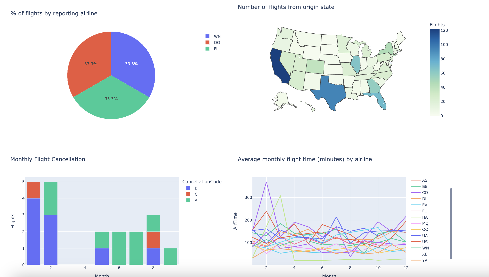

# US Domestic Airline Flights Performance Dashboard

This project is a dashboard application built with Plotly Dash that displays various performance metrics and delay statistics for US domestic airlines from 2005 to 2020. The dashboard provides insights into airline performance, including cancellation rates, average flight times, diverted airport landings, and delays due to various causes.

## Features

- Yearly Airline Performance Report:
  - Monthly flight cancellations by category
  - Average monthly flight time by reporting airline
  - Percentage of diverted airport landings per reporting airline
  - Number of flights from each origin state
  - Number of flights to each destination state by airline

- Yearly Airline Delay Report:
  - Average carrier delay time by airline
  - Average weather delay time by airline
  - Average NAS delay time by airline
  - Average security delay time by airline
  - Average late aircraft delay time by airline

## Images

## Data Source

The airline data used in this dashboard is sourced from IBM's Developer Skills Network. The dataset includes information on flight cancellations, delays, and other performance metrics.

## Project Explanation

For a detailed explanation of this project, please visit my [portfolio website](http://your-portfolio-link.com).

## Contributing

Contributions are welcome! Please fork the repository and create a pull request with your changes.

## License

This project is licensed under the MIT License. See the [LICENSE](LICENSE) file for details.

## Contact

For any questions or inquiries, please contact me at [main@leonardo-gold.com](mailto:main@leonardo-gold.com).

